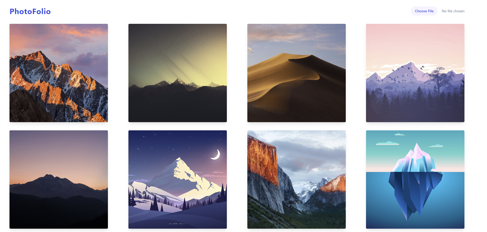

# Photofolio

This is a Spring Boot project that uploads images to s3 bucket and then displays them on a web page.

* Sub Modules Frontend : https://github.com/abhishekpatelmc/photofolio-frontend.git

## Demo


### Prerequisites

* Java 8
* Maven
* AWS account

### Installing

* Clone the repository
```bash
git clone https://github.com/abhishekpatelmc/photofolio.git
```
* Create a s3 bucket
* Create a IAM user with access to the s3 bucket
* Create a file called application.properties in src/main/resources and add the following properties
```properties
amazonProperties.accessKey=ACCESS_KEY
amazonProperties.secretKey=SECRET_ACCESS_KEY
amazonProperties.bucketName=BUCKET_NAME
amazonProperties.region=REGION
```

* Run the following command to build the project

```bash
mvn clean install
```
* Run the following command to start the app

```bash
mvn spring-boot:run
```
* Open a browser and go to http://localhost:8080

## Running Frontend

* Frontend Repo: https://github.com/abhishekpatelmc/photofolio-frontend.git

* Go to frontend folder
```bash
cd src/main/frontend
```
* Install dependencies
```bash
npm install
```
* Run the following command to start the app
```bash
npm run dev
```
* Open a browser and go to http://localhost:3000

## Built With Docker

* Run the following command to build the docker image
```bash
docker build -t photofolio .
```

* Run the following command to run the docker image
```bash
docker run -p 8080:8080 photofolio
```


 
